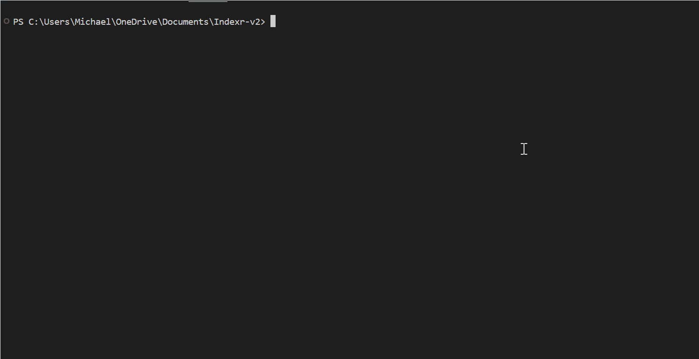
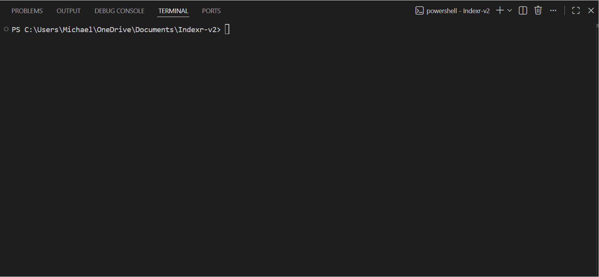

# OpenShard

<p align="center">
  <strong>The routing layer for AI coding.</strong>
</p>

<p align="center">
  OpenShard routes your coding tasks to the right model for each stage. 
  Better results, lower cost.
</p>

<p align="center">
  <a href="LICENSE"></a>
  <a href="#"></a>
  <a href="#"></a>
  <a href="#"></a>
</p>

---

## Demo

### Running a task

<p align="center">
  
</p>

### Inspecting the result

<p align="center">
  
</p>

---

## The Problem

**Using one expensive model for everything:**
```bash
Task: Add JWT auth with tests
Model: Opus 4.6 (for all stages)
Cost: ~$0.40
Time: ~90s
```

**Using OpenShard:**
```bash
Task: Add JWT auth with tests
Routing: Sonnet 4.6 (security-sensitive)
Cost: $0.12 (70% savings)
Time: 87s
Files: 6 created
```

Same quality. Smarter routing. Lower cost.

---

## Why routing matters now

Most coding tasks aren't uniformly hard. Think about what a typical feature 
actually involves:

- **Architecture decisions** - high risk, needs strong reasoning
- **Business logic** - moderate complexity
- **Scaffolding / boilerplate** - mostly pattern matching
- **Tests** - structured generation
- **Refactoring** - consistency and correctness

Only a fraction genuinely needs the best model available. The rest just 
needs something good enough.

But developers are still doing the routing themselves - manually switching 
models, retrying failures, deciding what's worth frontier-model spend. 
There's no clean open-source solution for that.

That's what OpenShard is.

---

## What it does

You give OpenShard one engineering task.

It inspects your repo, breaks the work into stages, picks the right model for 
each stage based on difficulty, cost, and context - then runs it. You approve 
before it executes. You review when it's done.

```bash
openshard run "add email/password auth with protected routes and tests"
```
Inspecting repo...
Stack detected: Next.js + TypeScript + PostgreSQL
Plan:
Auth design          ->  strong model      (security-sensitive)
UI scaffolding       ->  cost-optimized    (low-risk boilerplate)
Test generation      ->  mid model         (generation-heavy)
Final review         ->  strong model      (verification)
Estimated cost: $1.82
Proceed? [y/N]

**Task complete**

Auth flow implemented
Protected routes added
Tests: 18/18 passing
No unresolved errors

Time: 2m 14s  |  Cost: $1.82  |  Details: openshard report

That is the point. Your task gets done. You don't think about models.

---

## Where OpenShard fits

OpenShard does not replace your tools. It sits above them.

| Layer | Tool |
|---|---|
| Models | OpenAI, Anthropic, Google, open-source |
| Access | OpenRouter or direct API keys |
| Execution | Claude Code, Codex, OpenCode or direct patching |
| **Routing** | **OpenShard** |

Think of it as the decision layer - the brain that decides which model does 
what, so you don't have to.

**Best used with OpenRouter** - it gives OpenShard a bigger choice of models 
with live cost metadata across providers.

---

## Installation

```bash
# Install from PyPI (coming soon)
pip install openshard

# Or install from source
git clone https://github.com/MichaelObasa/openshard.git
cd openshard
pip install -e .
```

**Set your API key:**
```bash
export OPENROUTER_API_KEY=your_key_here
```

**Verify installation:**
```bash
openshard doctor
```

---

## Quick start

**1. Plan before you run**
```bash
openshard plan "build a FastAPI CRUD service with tests"
```

**2. Run the task**
```bash
openshard run "build a FastAPI CRUD service with tests" --write
```

**3. Review the result**
```bash
openshard last --more
```

That's it. OpenShard handles routing, execution, and cost tracking.

---

## Commands

```bash
openshard run "<task>"       # run the full workflow
openshard plan "<task>"      # see the plan before executing
openshard explain "<task>"   # understand the routing decisions
openshard last               # show last run summary
openshard last --more        # detailed breakdown of last run
openshard last --full        # complete run details
openshard report             # cost, time, and outcome summary
openshard models             # list available models
openshard config init        # set up your config
openshard doctor             # check your setup
```

**Flags:**
- `--write` - Actually write files (required for execution)
- `--verify` - Run tests/verification after execution
- `--more` - Show additional details
- `--full` - Show all available information
- `--dry-run` - Preview changes without writing
- `--executor [direct|opencode]` - Choose execution backend

---

## How it works

OpenShard has five core parts working in sequence:

**1. Task interpreter** - understands what you're asking  
**2. Repo analyzer** - detects stack, structure, and risky areas  
**3. Task splitter** - breaks work into stages by difficulty  
**4. Routing engine** - picks the right model per stage based on risk, 
cost, and capability  
**5. Executor** - applies patches, runs commands, verifies output, 
retries if needed
task -> inspect repo -> split stages -> route models -> execute -> verify -> report

---

## Routing logic

OpenShard uses a scoring approach, not a fixed model list. Each stage is 
scored on:

- **Risk** - auth, payments, migrations, security
- **Complexity** - novel logic vs. repetitive patterns
- **Verification strength** - can tests catch mistakes here?
- **Cost sensitivity** - where strong-model budget matters most

Then it maps to model classes:

| Stage type | Model class |
|---|---|
| Architecture / security-sensitive | Strongest available |
| Standard app logic | Mid-tier balanced |
| Boilerplate / scaffolding | Cost-optimized |
| Tests / docs | Efficient generation |
| Final review | Strongest available |

The model list is not hardcoded. Routing adapts as new models emerge.

---

## Real-world example

From a recent run on a production Flask app:

```bash
openshard run "add JWT authentication with login endpoint and token helpers" --write
```

**Result:**
Task: add JWT authentication with login endpoint and token helpers
Done
Added JWT authentication with login endpoint, token helpers, middleware,
and a protected route example
Model: Sonnet 4.6 (planning + implementation)
Stages
Planning (Sonnet 4.6): 7.8s, $0.0037
Implementation (Sonnet 4.6): 78.7s, $0.1144
Files: 6 created
jwt_helpers.py - Token generation and validation helpers
auth.py - User store, credential helpers, and login endpoint
app.py - Flask app with auth blueprint and protected routes
tests/test_jwt_helpers.py - Unit tests for token helpers
tests/test_auth.py - Integration tests for login endpoint
requirements.txt - Minimal dependencies (Flask, PyJWT, pytest)
Notes
Set JWT_SECRET environment variable in production
Replace SHA-256 password hashing with bcrypt before deployment
Token expiry defaults to 60 minutes (configurable via JWT_EXPIRY_MINUTES)
Time: 87.2s   Cost: $0.1181

**vs. using Opus 4.6 for everything:** ~$0.40  
**Savings:** 70%

---

## Configuration

> Model references below are accurate at time of release. The AI landscape 
moves fast - swap in whatever models suit your needs.

```yaml
provider: openrouter

workflow:
  - plan
  - execute
  - test
  - review

routing:
  planning:
    preferred_models:
      - anthropic/claude-sonnet-4-6      # strong reasoning
      - openai/gpt-5.4-thinking          # strong reasoning alternative
  hard_implementation:
    preferred_models:
      - anthropic/claude-sonnet-4-6      # strong coding
      - openai/gpt-5.4-thinking          # strong coding alternative
      - anthropic/claude-opus-4-7        # fallback/escalation
  cost_optimized_execution:
    preferred_models:
      - google/gemini-3.1-pro            # capable, cost-efficient
      - google/gemma-4-31b               # open-source, efficient
      - zhipu/glm-5-1                    # open-source, efficient
      - moonshot/kimi-k2-6               # open-source, efficient
      - minimax/minimax-2-7              # open-source, efficient
      - deepseek/deepseek-v3-2           # open-source, efficient
  review:
    preferred_models:
      - anthropic/claude-opus-4-6        # strong review
      - openai/gpt-5.4-thinking          # strong review alternative
```

---

## When not to use OpenShard

OpenShard is not the right tool if:

- You only use Cursor or Claude Code casually for small tasks
- You're on a flat subscription and don't care about per-token cost
- You want a GUI-first experience
- You're not using APIs or OpenRouter

It works best for developers using APIs directly, running multi-step feature 
work, or anyone where cost, reliability, and consistency across a real repo 
actually matters.

---

## FAQ

**Q: Does this work with Cursor/Claude Code?**  
A: Yes. OpenShard sits above your existing tools. We handle routing, they can handle execution.

**Q: What models does it support?**  
A: Currently 100+ models via OpenRouter. Direct OpenAI and Anthropic support coming soon.

**Q: Is my code safe?**  
A: Everything runs locally. Your code never leaves your machine unless you're using a cloud execution backend (which is optional).

**Q: How accurate is the cost estimation?**  
A: Pre-run estimates are ranges based on task complexity. Post-run costs are exact when using OpenRouter (which returns token counts). We're working on tighter estimates.

**Q: Can I use my own models?**  
A: Yes, if they're accessible via OpenRouter or have a compatible API. Custom provider support is on the roadmap.

**Q: What if a task fails?**  
A: OpenShard automatically retries with a stronger model. If that fails, you get a clear error message and can inspect what went wrong.

---

## Status and roadmap

Alpha. The core CLI, routing engine, and OpenRouter integration work today.

**v0.1 - current (working now)**
- CLI with core commands
- OpenRouter integration
- Basic routing (direct vs agentic)
- Cost tracking and reporting
- Retry logic with model escalation
- Run history
- Post-run inspection (`openshard last`)

**v0.2 - next (coming soon)**
- Task-type classification (auth, tests, refactoring, etc.)
- Benchmark-informed routing
- Better cost estimation
- Multi-provider support (OpenAI, Anthropic direct)
- Baseline cost comparisons

**v0.3 - future**
- Team policies ("always use X model for auth")
- Hosted run history
- Usage analytics
- Adaptive routing from success/failure data
- IDE extensions

**Long-term vision**
- Control plane for AI agents
- Multi-agent orchestration
- Agent IAM and governance
- Full observability platform

---

## Why open source?

Routing decisions should be inspectable. If a tool is deciding which model 
touches your security-sensitive code, you should be able to see why.

OpenShard is open because trust matters, integrations matter, and the best 
routing policies will come from genuine usage from many developers - not just 
one person's assumptions.

---

## Contributing

Contributions welcome around:

- Routing policies and scoring logic
- Repo analyzers for new stacks
- Model profiles and capability data
- Evaluation datasets
- Provider integrations
- CLI UX improvements

See [CONTRIBUTING.md](CONTRIBUTING.md) for details.

---

## Security

If you find a security issue, please report it privately before opening a 
public issue. See [SECURITY.md](SECURITY.md).

---

## License

MIT
